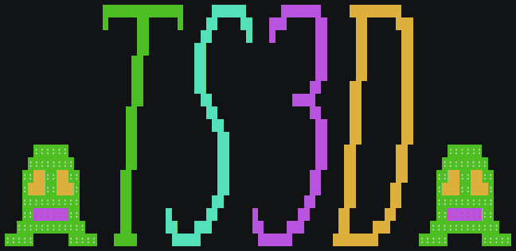

## Overview

Thing Shooter 3D is a mostly finished first-person shooter. It uses
terminal-based 3D graphics.

## Building

Run make in the project root. This does not account for updates to dependencies.
To update those, see **Dependencies**.

To build the tests, run `make tests`. A binary `tests` will be produced.

## Running

To run the game, type `TS3D_ROOT=. ./ts3d`. More information is available with
`./ts3d -h`, `man ./ts3d.6`, or through in-game help.

To run the tests and print the colored output, do `make run-tests`. You can also
call `ceeteef` directly.

## Installation

To install, run `make install exe-dir=</usr/bin or something>
man-dir=</usr/share/man/man6 or whatever>`. A script will be launched taking you
through the installation procedure. If something goes wrong, run `make uninstall
<same parameters as before>`. You may be asked to type your password to move
files to a privileged directory. Be careful, as the installer isn't the best. It
will, however, print out lots of stuff so you know what it did wrong.

If all goes well, you will be able to type `ts3d` or `man ts3d` and have good
stuff happen.

## Data

The data/ directory holds game data. The data is stored in a combination of JSON
and simpler custom formats. It is organized into sub-directories. The formats
are described in detail in data/README.

Textures and animations can be viewed with `./texture ...`. For example, to view
the frog animation, use `./texture animate data/ents/frog.json`.

## Dependencies

The external/ folder holds dependencies to other projects, with source code and
such bundled here. There are currently three dependencies, all of which I myself
created. d3d/ is the 3D graphics library. json/ is the JSON parser.
c-test-functions/ (or ctf) is the testing framework.

The ctf API is included, but not the executable. To run the tests, you will need
to install that in your PATH yourself.

To update the dependencies from Github, run `external/update-all`.
